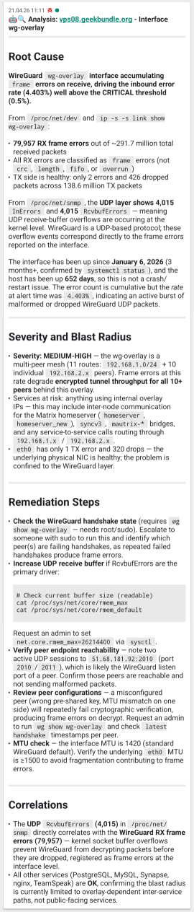

# Claude Alert Analyzer

<a href="docs/screenshot01.png"></a>

LLM-powered root-cause analysis for monitoring alerts. Incoming alerts from Alertmanager (Kubernetes) or CheckMK trigger automated diagnostic collection, which is sent to Claude for analysis. The resulting root-cause assessment is delivered to operators via [ntfy](https://ntfy.sh).

Instead of staring at a 3 AM "DiskPressure" alert and manually running ten `kubectl` / `ssh` commands, you get a short markdown summary on your phone: likely cause, blast radius, suggested remediation — derived from real metrics, events, pod logs, and (for CheckMK hosts) live SSH diagnostics.

<br clear="left">

## How It Works

```
Alert fires → Webhook → Gather diagnostics → Claude / LLM API → ntfy notification
```

Two independent analyzers share a common library but run as separate binaries:

| Analyzer | Alert Source | Diagnostics Gathered |
|----------|-------------|---------------------|
| **k8s-analyzer** | Alertmanager webhook | Prometheus metrics, K8s events, pod status, pod logs |
| **checkmk-analyzer** | CheckMK notification script | CheckMK REST API (host/service state), agentic SSH diagnostics |

Both deduplicate repeat alerts (configurable cooldown) and process work concurrently (5 workers, queue depth 20). All diagnostic output is passed through a secret-redaction filter before leaving the analyzer.

# Operations

## Prerequisites

- An [Anthropic API key](https://console.anthropic.com/) (or an OpenRouter key for other LLMs)
- An [ntfy](https://ntfy.sh) server for receiving analysis results
- **k8s-analyzer**: Kubernetes cluster with Alertmanager
- **checkmk-analyzer**: CheckMK instance with an automation user, and SSH access to monitored hosts

## Container Images

Pre-built images are published to GHCR on every push to `main`:

```
ghcr.io/madic-creates/claude-alert-kubernetes-analyzer:latest
ghcr.io/madic-creates/claude-alert-checkmk-analyzer:latest
```

Both are also tagged with the short commit SHA (e.g. `:a1b2c3d`) for pinning.

| Image | Base | Size |
|-------|------|------|
| `claude-alert-kubernetes-analyzer` | `scratch` | ~13 MB |
| `claude-alert-checkmk-analyzer` | `alpine:3.23` | ~25 MB (includes `openssh-client`) |

## Installation — K8s Analyzer

### 1. Deploy the analyzer

Deploy `ghcr.io/madic-creates/claude-alert-kubernetes-analyzer:latest` into your cluster. The analyzer uses in-cluster config (`rest.InClusterConfig()`) and must therefore run inside the cluster it is analyzing.

Minimum required environment variables:

- `WEBHOOK_SECRET` — bearer token that Alertmanager must present
- `API_KEY` — Anthropic or OpenRouter API key
- `PROMETHEUS_URL` — only if your Prometheus isn't at the default address

The analyzer needs read access to cluster resources (events, pods, pod logs) — bind it to a ServiceAccount with `get`/`list`/`watch` on `events`, `pods`, and `pods/log` in the namespaces listed in `ALLOWED_NAMESPACES`.

### 2. Configure Alertmanager

Add a webhook receiver pointing at the analyzer's `/webhook` endpoint with the matching bearer token:

```yaml
routes:
  - receiver: claude-analyzer
    matchers:
      - severity =~ "warning|critical"
    continue: true
  - receiver: claude-analyzer
    matchers:
      - alertname = "CPUThrottlingHigh"
receivers:
  - name: claude-analyzer
    webhook_configs:
      - url: http://claude-k8s-analyzer.monitoring:8080/webhook
        http_config:
          authorization:
            type: Bearer
            credentials: <WEBHOOK_SECRET>
```

## Installation — CheckMK Analyzer

### 1. Deploy the analyzer

Deploy `ghcr.io/madic-creates/claude-alert-checkmk-analyzer:latest`:

- Required env vars: `WEBHOOK_SECRET`, `API_KEY`, `CHECKMK_API_USER`, `CHECKMK_API_SECRET`
- SSH private key mounted at `/ssh/id_ed25519`
- SSH `known_hosts` file mounted at `/ssh/known_hosts` (strict host checking — no TOFU)

The SSH user (`SSH_USER`, default `nagios`) must be an **unprivileged** account. The analyzer enforces a command denylist on top of that as defense in depth.

### 2. Install the notification script

The script at `scripts/claude-analyzer-notify.sh` bridges CheckMK notifications to the analyzer webhook:

```bash
cp scripts/claude-analyzer-notify.sh \
  /omd/sites/<site>/local/share/check_mk/notifications/
chmod +x /omd/sites/<site>/local/share/check_mk/notifications/claude-analyzer-notify.sh
```

For containerized CheckMK deployments, mount the script via a ConfigMap.

### 3. Create a notification rule in CheckMK

1. Go to **Setup > Notifications > Add rule**
2. Notification method: **Custom script** `claude-analyzer-notify.sh`
3. Parameter 1: Webhook URL (default: `http://claude-checkmk-analyzer.monitoring:8080/webhook`)
4. Parameter 2: Webhook secret (must match `WEBHOOK_SECRET`)
5. **Enable "Recovery" as a notification event** — required for cooldown deduplication to work correctly.

Script exit codes: `0` = success, `1` = 503/queue full (CheckMK will retry), `2` = fatal error.

> **Why Recovery notifications are required:** When a service fires, a cooldown prevents duplicate analysis. If the service recovers and fails again inside the cooldown window, the second failure would be silently suppressed without a Recovery notification to clear the cooldown. Enabling Recovery ensures any subsequent PROBLEM after a recovery is analyzed immediately.

### 4. (Optional) Host context via custom attribute

The checkmk-analyzer can inject operator-provided host notes into the Claude prompt, giving the model host-specific context (OS, config paths, operational hints) before it starts investigating. This saves SSH rounds spent discovering basics.

Setup in CheckMK:

1. **Setup > Custom host attributes > Create new attribute**
2. Name: `ai_context`, Topic: Custom attributes, Data type: Simple Text
3. Tick "Show in host tables"

Example value:

```
Debian 12, Nginx reverse proxy. Config: /etc/nginx/sites-enabled/. On disk-alerts first check /var/log/nginx.
```

When set, the attribute appears as a "Host Context (operator-provided)" section in the prompt, before alert details. Content is sanitized (control chars stripped, trimmed, truncated at 2 KB). Hosts without the attribute behave exactly as before.

## Configuration

### Shared environment variables

| Variable | Default | Description |
|----------|---------|-------------|
| `WEBHOOK_SECRET` | **(required)** | Bearer token for webhook authentication |
| `API_KEY` | **(required)** | Anthropic or OpenRouter API key |
| `API_BASE_URL` | `https://api.anthropic.com/v1/messages` | LLM API endpoint |
| `CLAUDE_MODEL` | `claude-sonnet-4-6` | Model ID for analysis |
| `PORT` | `8080` | HTTP listen port for `/health` and `/webhook` |
| `METRICS_PORT` | `9101` | Port for the Prometheus `/metrics` endpoint |
| `COOLDOWN_SECONDS` | `300` | Seconds before re-analyzing the same alert |
| `NTFY_PUBLISH_URL` | `https://ntfy.example.com` | ntfy server URL |
| `NTFY_PUBLISH_TOPIC` | *(varies per analyzer)* | ntfy topic name |
| `NTFY_PUBLISH_TOKEN` | *(empty)* | ntfy auth token (optional) |
| `LOG_LEVEL` | `info` | `debug`, `info`, `warn`, `error` |

### K8s analyzer

| Variable | Default | Description |
|----------|---------|-------------|
| `PROMETHEUS_URL` | `http://kube-prometheus-stack-prometheus.monitoring.svc.cluster.local:9090` | Prometheus endpoint |
| `ALLOWED_NAMESPACES` | `monitoring,databases,media` | Namespaces from which pod logs may be collected |
| `MAX_LOG_BYTES` | `2048` | Per-pod log truncation limit |
| `SKIP_RESOLVED` | `true` | Ignore resolved alerts |
| `NTFY_PUBLISH_TOPIC` | `kubernetes-analysis` | Default ntfy topic |

### CheckMK analyzer

| Variable | Default | Description |
|----------|---------|-------------|
| `CHECKMK_API_URL` | `http://checkmk-service.monitoring:5000/cmk/check_mk/api/1.0/` | CheckMK REST API URL |
| `CHECKMK_API_USER` | **(required)** | CheckMK automation user |
| `CHECKMK_API_SECRET` | **(required)** | CheckMK automation secret |
| `SSH_ENABLED` | `true` | Enable agentic SSH diagnostics (`false` = analyze without SSH) |
| `SSH_USER` | `nagios` | SSH user for host diagnostics |
| `SSH_KEY_PATH` | `/ssh/id_ed25519` | Path to SSH private key |
| `SSH_KNOWN_HOSTS_PATH` | `/ssh/known_hosts` | Path to known_hosts file |
| `SSH_DENIED_COMMANDS` | *(built-in default)* | Comma-separated denylist. Empty = no guardrails. See [`DefaultDeniedCommands`](internal/checkmk/agent.go) for the current default list |
| `MAX_AGENT_ROUNDS` | `10` | Max SSH command rounds per agentic analysis |
| `NTFY_PUBLISH_TOPIC` | `checkmk-analysis` | Default ntfy topic |

The default denylist is defined in [`internal/checkmk/agent.go`](internal/checkmk/agent.go) as `DefaultDeniedCommands` — consult the source for the authoritative, always-current list. It covers destructive filesystem commands, privilege escalation, process/user management, networking and mount tools, shells and interpreters, and similar classes.

`systemctl` is a special case: when denied, read-only subcommands (`status`, `show`, `is-active`, `is-failed`, `is-enabled`, `list-units`, `list-unit-files`, `list-timers`, `list-sockets`, `list-dependencies`) are still allowed.

### LLM provider

The Claude client auto-detects the provider from `API_BASE_URL`:

| Provider | Detection | Auth header |
|----------|-----------|-------------|
| Anthropic | URL contains `anthropic.com` | `x-api-key` + `anthropic-version: 2023-06-01` |
| OpenRouter / other | Everything else | `Authorization: Bearer` |

Response tokens are capped at 2048.

## API Endpoints

Both analyzers expose two HTTP servers:

**Main server** (`PORT`, default `8080`)

- `GET /health` — liveness probe, returns `200 ok`
- `POST /webhook` — alert receiver, requires `Authorization: Bearer <WEBHOOK_SECRET>`

**Metrics server** (`METRICS_PORT`, default `9101`)

- `GET /metrics` — Prometheus metrics, no authentication required

## Observability

### Metrics

The `/metrics` endpoint exposes Prometheus-format data in two sections.

**Operational counters** (unlabeled, always present):

| Metric | Type | Description |
|--------|------|-------------|
| `alert_analyzer_webhooks_received_total` | counter | Total webhook requests received |
| `alert_analyzer_alerts_queued_total` | counter | Alerts enqueued for processing |
| `alert_analyzer_alerts_queue_full_total` | counter | Alerts dropped because queue was full |
| `alert_analyzer_alerts_cooldown_total` | counter | Alerts skipped due to active cooldown |
| `alert_analyzer_alerts_processed_total` | counter | Alerts successfully analyzed and published |
| `alert_analyzer_alerts_failed_total` | counter | Alerts where analysis or publishing failed |
| `alert_analyzer_processing_duration_seconds` | summary | Processing time per alert |

**Labeled metrics** (with `source` and/or `severity`):

| Metric | Type | Labels | Description |
|--------|------|--------|-------------|
| `alerts_analyzed_total` | counter | `source`, `severity` | Alerts successfully analyzed |
| `alerts_cooldown_total` | counter | `source` | Alerts skipped due to active cooldown |
| `queue_depth` | gauge | `source` | Current alerts waiting in the work queue |
| `claude_api_duration_seconds` | histogram | — | Claude API call latency |
| `claude_api_errors_total` | counter | `source` | Claude API errors |
| `ntfy_publish_errors_total` | counter | `source` | ntfy publish failures |

`source` is `k8s` or `checkmk`.

Example scrape config:

```yaml
- job_name: claude-alert-analyzer
  static_configs:
    - targets: ['claude-alert-analyzer.monitoring:9101']
```

### Logging

Structured JSON logs to stdout via Go's `slog`. Verbosity is controlled by `LOG_LEVEL` (`debug`, `info`, `warn`, `error`). Collect with whichever log pipeline you already use.

## Security

### Both analyzers

- Non-root execution (UID 65534)
- Read-only root filesystem
- All Linux capabilities dropped
- Fail-closed webhook auth (missing/invalid token → rejected)
- All gathered output passes through a secret-redaction filter before being sent to Claude (passwords, tokens, API keys, PEM blocks, emails)
- Claude response tokens capped at 2048

### CheckMK analyzer (additional)

- **Host validation**: both `hostname` and `host_address` from the alert must match a known CheckMK host before any SSH connection is attempted
- **Strict SSH**: `known_hosts` mounted from a ConfigMap (no TOFU), key mounted as a volume (not via env var), no `ForwardAgent`
- **Command denylist**: destructive/privileged commands blocked (defense in depth on top of an unprivileged SSH user)
- **No shell**: commands run via SSH `exec` (argv), not through an interpreter
- **No privilege escalation**: SSH user is unprivileged; no `sudo`, `su`, `dmesg`, or `pkexec`

### Operational diagnostics (checkmk SSH)

Claude autonomously decides which commands to run on the alerted host via SSH, capped at `MAX_AGENT_ROUNDS` (default 10) rounds per analysis.

**Allowed** — any read-only diagnostic command (`df`, `free`, `top`, `ps`, `journalctl`, `cat`/`tail`/`head` on logs, `ss`, `ip`, `du`, `lsblk`, `lsof`, `find`, `systemctl status/show`, …)

**Denied** — destructive / state-modifying commands, defined in [`DefaultDeniedCommands`](internal/checkmk/agent.go). Configurable via `SSH_DENIED_COMMANDS`; set empty to disable all guardrails.

Command output is redacted and truncated per command before being sent to Claude.

## Maintenance

### Image updates

The [`build.yaml`](.github/workflows/build.yaml) workflow rebuilds and pushes both images on every push to `main` that touches `cmd/`, `internal/`, `Dockerfile`, `go.mod`, or `go.sum`. The workflow runs `go vet`, `go test -race`, and `golangci-lint` before publishing. Images are tagged with both the short commit SHA and `latest`.

To pin a specific build, reference the SHA tag in your deployment manifest.

### Dependency updates

Renovate runs daily against Go modules, Docker base images, GitHub Actions, and pre-commit hook versions. Patch and minor updates automerge; major updates require manual approval. See [docs/renovate.md](docs/renovate.md) for configuration details and manual runs.

### GHCR image cleanup

A weekly workflow prunes old tags — keeps the newest `KEEP_TAGGED` (default 10) tagged versions and deletes all untagged/dangling manifests. See [docs/cleanup-ghcr.md](docs/cleanup-ghcr.md) for tuning.

# Development

Everything below is only relevant if you want to build, test, or modify the analyzer itself. For running it, the sections above are sufficient.

## Prerequisites

- Go 1.26+ (no CGO)
- Docker (for container builds)

## Build

```bash
# Build both binaries
CGO_ENABLED=0 go build -o k8s-analyzer ./cmd/k8s-analyzer/
CGO_ENABLED=0 go build -o checkmk-analyzer ./cmd/checkmk-analyzer/

# Multi-stage Docker build (two targets)
docker build --target k8s-analyzer      -t claude-alert-kubernetes-analyzer .
docker build --target checkmk-analyzer  -t claude-alert-checkmk-analyzer .
```

## Test

```bash
# All tests
go test ./...

# Specific package
go test ./internal/shared/
go test ./internal/checkmk/

# Race detector (as in CI)
go test -race -count=1 ./...
```

## Project Layout

- `internal/shared/` — common types (`AlertPayload`, `BaseConfig`, `AnalysisContext`), Claude API client, ntfy publisher, cooldown manager, secret redaction, HTTP server scaffolding, metrics
- `internal/k8s/` — Alertmanager webhook handler, Prometheus queries, Kubernetes context gathering (events, pod status, logs with namespace allowlist)
- `internal/checkmk/` — CheckMK webhook handler, CheckMK REST API client, agentic SSH runner with alert-category detection (CPU/disk/memory/service)
- `cmd/k8s-analyzer/` and `cmd/checkmk-analyzer/` — entrypoints: config loading, worker pool, HTTP server, graceful shutdown

## Key Patterns

- **Alert normalization** — both sources convert into `shared.AlertPayload` with a `Fields map[string]string` for source-specific data. k8s uses `label:` and `annotation:` prefixed keys.
- **Context gathering** — each analyzer exposes `GatherContext(...)` returning `shared.AnalysisContext` (a list of named sections rendered into the prompt). Data collection runs concurrently: k8s fans out Prometheus + kube context; checkmk fans out host services + SSH.
- **Cooldown dedup** — `CooldownManager` prevents re-analyzing the same alert within the configured TTL. The cooldown is cleared on analysis failure so retries work.
- **Provider flexibility** — the Claude client auto-detects Anthropic vs OpenRouter based on `API_BASE_URL`.

## Pre-commit

This repo uses [pre-commit](https://pre-commit.com/) for local hygiene (trailing whitespace, line endings, private-key detection, smart-quote fixup, `golangci-lint --new-from-rev HEAD --fix`, `go test` on staged packages). Install once with `pre-commit install`. See [docs/pre-commit.md](docs/pre-commit.md).

## CI/CD

GitHub Actions (`.github/workflows/build.yaml`) runs tests and lint, then builds and pushes both images to GHCR on every qualifying push to `main`:

- `ghcr.io/madic-creates/claude-alert-kubernetes-analyzer:{sha,latest}`
- `ghcr.io/madic-creates/claude-alert-checkmk-analyzer:{sha,latest}`

Further docs:

- [docs/pre-commit.md](docs/pre-commit.md) — pre-commit hook configuration
- [docs/renovate.md](docs/renovate.md) — dependency update automation
- [docs/cleanup-ghcr.md](docs/cleanup-ghcr.md) — GHCR tag retention
